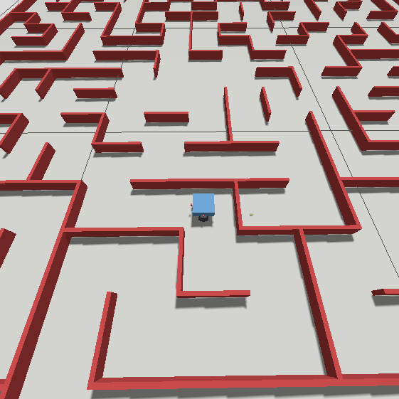
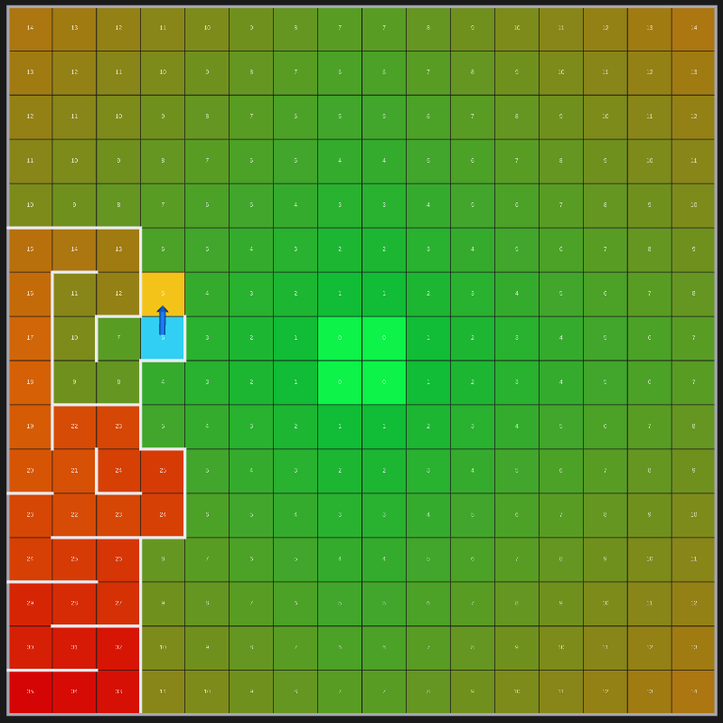
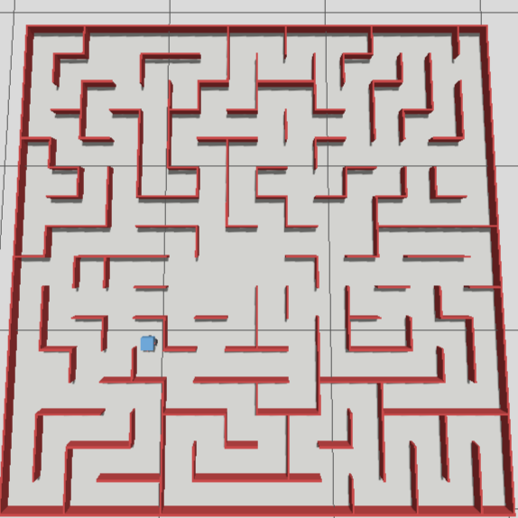
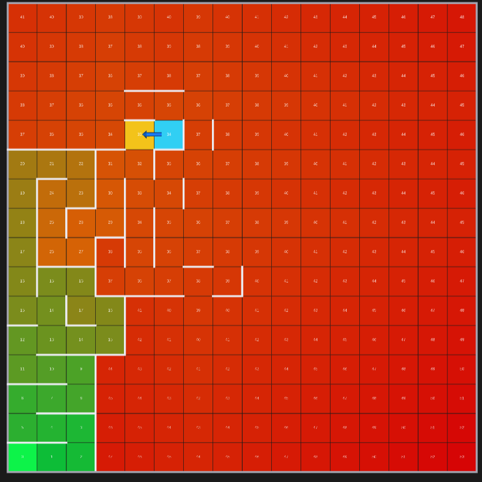
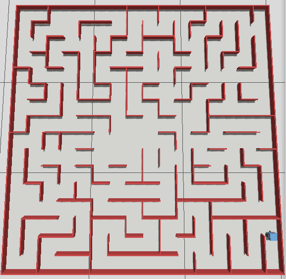
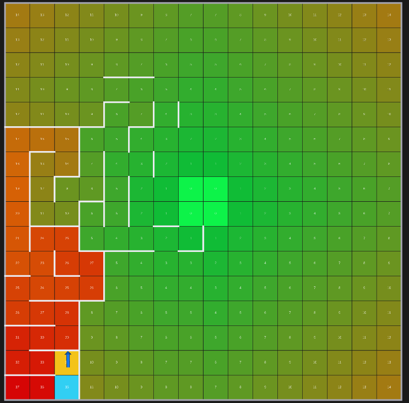
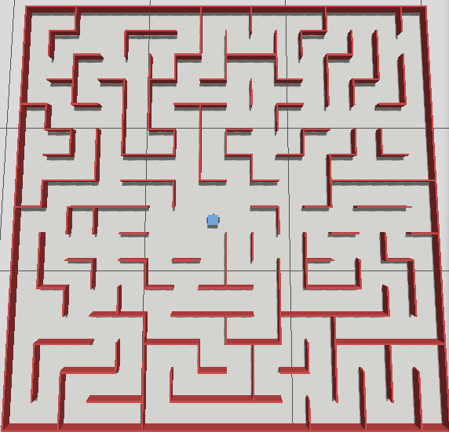
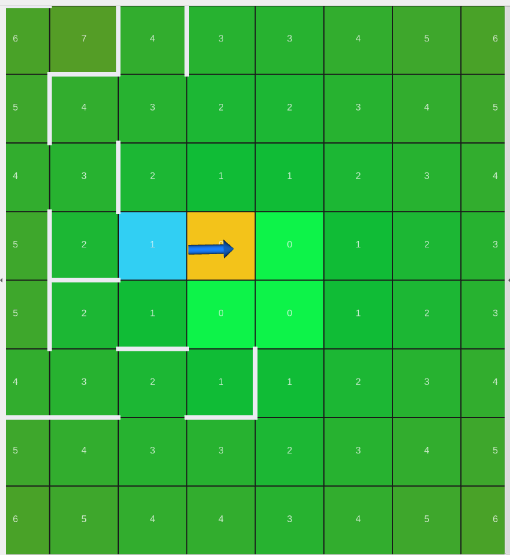

# Micromouse Challenge

> A robot is dropped into a 16×16 maze. It has to find its way to the center, its way back out, and then
> knowing the maze, race for the center. 


*Micromouse, mid-exploration*

---

## About the Challenge

Micromouse is, by a wide margin, one of the longest-running robotics competitions in the
world. The [IEEE](https://spectrum.ieee.org/the-amazing-micromouse-contest) ran the first
contest in 1977; London hosted Europe's first in 1980, Paris a year later, and the sport
has been quietly producing astonishing little machines ever since. The premise has barely
changed in nearly fifty years: a small, fully autonomous robot is placed in a maze of
**16×16 cells**, and it has to find the four-cell block at the center.

The maze is standardized down to the millimeter. Each cell is **18 cm** square; each wall
is **1.2 cm** thick and **5 cm** tall. The robot starts in a corner, the goal is the 2×2
block in the middle, and the robot has never seen this particular maze before.
No remote control, no external compute, no maps handed to it. Everything it knows, it has to
discover by bumping its sensors up against walls.

What makes micromouse beautiful is the *two-run structure*. A competitive run isn't a single
heroic dash. As the
[competition rules](https://ubieee.github.io/wiki/micromouse/competition-rules/) and the
[Wikipedia history](https://en.wikipedia.org/wiki/Micromouse) both describe it, a mouse uses
its early runs to *methodically search* the maze and build a map, and only then, on a later
run, does it try to *race* the now known shortest path to the center. The clock only cares
about that fast run. Search slow, run fast.

The classic strategy for the search is **flood fill**: the robot imagines water poured into
the goal, spreading outward one cell at a time, and at every moment it simply walks downhill
toward the goal along the steepest descent of that flood, re-pouring the water every time it
discovers a wall that blocks a route it had assumed was open.

---

## Architecture:

The single most important decision in the whole project was to split the robot's intelligence
into **two tiers that are not allowed to know about each other's world model**.

```
        Gazebo (gz sim)  —  maze world + robot body + physics
        |            |             |              |
  IR rays x3      IMU         wheel encoders   ground-truth pose
        |            |             |              |
        v            v             v              v
   ros_gz_bridge  ros_gz_bridge  gz_ros2_control  ros_gz_bridge
        |            |             |              |
        v            v             v              v
 /ir_front       /imu        /joint_states   /ground_truth/tf
 /ir_left                         |            (analysis only)
 /ir_right                        |
        |                         v
        |            ┌─────────────────────────────┐
        |            │   pid_controller_node        │   TIER 1: the body
        |            │   "hold this heading,        │   (knows nothing of the maze)
        |            │    move at this speed"       │
        |            └─────────────────────────────┘
        |                         |
        |          /wheel_velocity_controller/commands → wheels
        |                         |
        |                  /odom (dead-reckoned pose)
        |                         |
        v                         v
   ┌──────────────────────────────────────────────┐
   │   solver_node                                  │  TIER 2: the mind
   │   floodfill map • explore/return/run phases    │  (knows nothing of motors)
   │   wall-referenced centering • collision recover│
   └──────────────────────────────────────────────┘
        |                         |                    |
        v                         v                    v
 /motion_setpoint        /odom_corrected          /maze_viz
 (heading, speed) ───────────────────────────────► RViz
        │
        └──────────────► back up to TIER 1
```

**Tier 2 is the mind.** It reasons about the maze: which direction to go, how far off the
corridor centerline the body has drifted, whether it has reached a cell, whether it has hit a
wall. It never thinks about motors.

**Tier 1 is the body.** It receives a single instruction "face this direction, move at this
speed" and turns that into wheel commands. It never thinks about the maze.

The entire interface between these two worlds is a message with exactly **two floating-point
numbers**: a target heading and a target speed. That's it. A speed of zero means "rotate in
place to face that heading." Feedback flows the other way as an odometry estimate.

---

## The robot

The mouse itself is deliberately simple: a small differential drive chassis, a 7 cm box on
two driven wheels, with low-friction caster spheres front and back for balance. It carries
just two kinds of senses:

**Three single-ray range sensors**, pointing front, left, and right that return a noisy distance.

**IMU** as primary heading refference. 
The obvious way to know your heading on a two-wheeled robot is to count wheel rotations: 
if the right wheel has turned further than the left, you've rotated. It works, right up until a wheel slips, 
which on a real robot happens constantly espacially during turns, exactly when heading matters most.
The wheel-encoder heading still exists, but only as a fallback for the first fraction of
a second before the IMU comes online.

There's one more piece of physical cunning baked into the robot: its **friction model is
intentionally lopsided**. The wheels are grippy. The chassis shell, on the other hand, is
made *slippery*. The reason is subtle and was learned the hard way — if the body box catches
on a wall and *grips* it, the robot pivots around that contact point, which slips the wheels,
which sends the dead-reckoned position racing off into fantasy. A slippery shell means a
glancing touch just *slides* along the wall instead of grabbing it. Traction belongs to the
wheels and nowhere else.

---

## Tier 1:

The controller's job sounds trivial — hold a heading, hold a speed — and getting it to be
*stable* taught us two of the project's most valuable lessons.

**Lesson one: measure time, never assume it.** The control loop ticks on a timer, and the
naive thing is to assume each tick covers exactly one period — say, one hundredth of a second
at 100 Hz. But the timer fires on real wall-clock time, while the *simulation's* clock runs at
whatever real-time factor Gazebo can manage, and on our machine that was often less than half
of real time. So every tick actually covered more than twice as much simulated time as we'd
assumed. Every quantity that depends on elapsed time — the integrated position, every term in
every controller — was silently scaled wrong by that factor. The fix was to stop assuming and
start measuring: read the simulated clock, take the *actual* elapsed time, and use that. It's
a one-line idea that quietly corrupts everything if you get it wrong.

**Lesson two: don't stack a feedback loop on top of one that already works.** Our first design
had a clean outer loop for heading and then, underneath it, a second loop on each wheel that
tried to trim the wheel's velocity to match its command. It seemed thorough. It was a disaster.
The simulation's wheel interface *already* servos each wheel to its commanded velocity, nearly
perfectly. Our extra trim loop was correcting an error that was already being corrected, so it
ended up chasing its own tail — the measured velocity converged toward the command *including*
our trim, which fed the trim error back on itself and wound up into a sustained oscillation.
That double loop was the single biggest source of wheel jitter and the slip that let odometry
drift. We deleted it. What's left is one clean chain: a heading error drives a proportional
turn rate, which becomes two wheel velocities, which the servo just executes. Simpler, and
correct.

The heading controller itself is proportional-only — no integral, no derivative. The math
behind the robot's turning behaves like a pure integrator, and for a plant like that,
proportional feedback alone converges smoothly without overshoot. Adding a derivative term
would have done nothing but amplify noise every time the timestep shrank. Sometimes the
disciplined move is to leave the knobs at zero.

---

## Tier 2:

Now the interesting half. The solver carries two things in its head: a **map of walls it has
discovered**, and a **flood of distances** to wherever it currently wants to go.


*The robot's mind, rendered live in RViz. Each cell is colored by its flood-fill distance to the goal — bright green at the center goal block, fading through yellow to red far away — with the number written in. The cyan cell with the blue arrow is where the robot believes it is and which way it's facing; the amber cell is where it's heading next. Notice the map is mostly empty: only the walls it has actually bumped into (the white segments on the left) are known yet.*

The map starts *optimistic*. The robot assumes every interior wall is absent until proven
otherwise — only the outer boundary is known to be walled. This optimism is what makes flood
fill work: the robot always has *some* believed-shortest path to chase, and it only revises
that belief when reality (a sensor reading) contradicts it.

The flood itself is a distance field. Pour imaginary water into the goal cells at distance
zero; every open neighbor is distance one, their neighbors distance two, and so on outward
until the whole reachable maze has a number. To decide where to go, the robot just looks at
its open neighbors and steps to whichever has the *smallest* number — downhill toward the
goal. When two neighbors tie, it breaks the tie by preferring to keep going straight, because
turning is slow and costs alignment.

The genuinely clever part is what happens when the robot discovers a wall. A naive
implementation would re-pour the entire flood from scratch every time — recompute all 256
distances on every single wall sighting. Ours doesn't. When a new wall appears, it only
re-examines the handful of cells whose distance could *actually change* because of it, and
stops the moment the ripple dies out. Most wall discoveries touch only a cell or two. The
flood updates continuously and cheaply as the robot feels its way along, never grinding to
recompute a grid that mostly didn't change.

Around this map sits a small state machine that repeats for every cell: **SENSE** the walls
and decide the next direction; **TURN** in place if the next direction isn't straight ahead;
**DRIVE** forward to the next cell's center; and back to SENSE. If the robot is already facing
the right way, it skips the stop-and-turn entirely and flows straight through, so long
corridors get taken in one smooth motion instead of a stutter of cell-by-cell pauses.

---

## Act I — Exploration

With all that in place, the first act is the search. The robot leaves the corner and floods
toward the center, sensing as it goes, marking walls, watching the distance field reshape
itself around each discovery, always stepping downhill.

We made one counterintuitive choice here: **exploration is deliberately slow.** It would be
satisfying to have the robot tear around during the search too, but the range sensors only
update so many times per second, and under a low simulation real-time factor that means very
few readings per cell at speed. Sense too fast and you sense too little — you blow through a
cell having taken two noisy samples and call a wall open that isn't. So the search ambles. The
*timed* run comes later; this phase optimizes for a complete, correct map, not for the clock.

By the end of Act I the robot stands in the center goal block, and a good chunk of the maze is
now drawn into its memory.

---

## Act II — The return, and re-pointing the flood

A real micromouse doesn't stop at the center. It has to get back to the start to run again —
and the trip back is free mapping. So the second act sends the robot home, and here we get to
show off the one idea that makes flood fill feel almost alive.


*The full maze from above, with the robot partway through its return journey to the start corner. Every wall here is real, rigid geometry it has to physically navigate.*

To send the robot back to the start, we don't write any new navigation logic at all. We simply
**move the goal.** We re-pour the flood — this time with the water poured into the *start*
corner instead of the center — and the exact same "walk downhill" rule that carried the robot
inward now carries it back out. One distance field, re-seeded, and the whole behavior reverses.


*The same mind, now flooding toward the start. The bright-green zero is the bottom-left start corner; the gradient runs the other way, red toward the far side. The robot's arrow now points back the way it came. Compared to Act I, far more of the wall map is filled in.*

The return trip hides a sharp little subtlety, too. As the robot re-crosses cells from new
angles, sensor noise and slight off-center positioning can occasionally make a *real* wall
read as open for a frame. During the outward search we let the robot erase walls it now sees
as clear — that's how it recovers from a false positive. But on the return trip we *stop*
letting it erase walls, and only let it add them. The reasoning: a physical wall never
actually vanishes, so any "this wall is gone now" reading on the second pass is far more likely
to be noise than truth — and erasing a correct wall opens a phantom shortcut that sends the
robot driving straight into the real thing. Trust new walls always; trust *disappearing* walls
only while you're still building the map for the first time.

---

## The hard part: fighting the physical world

Everything up to here would more or less work in a clean grid simulator. None of it survives
contact with real physics on its own. The bulk of the engineering — and very nearly all of the
debugging — went into a layer whose entire job is to keep a slipping, drifting, occasionally-
colliding body honestly localized inside its own map. Three ideas carry that weight.

**Steer off the walls, not off your own guesswork.** The robot needs to stay centered in each
corridor, not just pointed the right way — heading-perfect and still drifting sideways into a
wall is entirely possible. The tempting fix is to steer back toward the cell's centerline using
your estimated position. This is a trap, and a vicious one: the position estimate is exactly
the thing that's drifting, so a phantom drift in the estimate steers the *real* body off
center, which makes the real drift worse, which the estimate then exaggerates further. It's
positive feedback straight into a wall. The escape is to ignore the estimate entirely for
centering and steer off the **walls themselves**, measured directly by the side range sensors.
The walls don't drift. If the left wall reads closer than the right, ease right — simple,
absolute, and immune to the feedback trap.

**Pin your position to the walls, gently.** The dead-reckoned position is pure wheel
integration, and it races ahead of the real body every time a wheel slips. But the walls are a
perfect, drift-free ruler: when there's a wall a known distance ahead, the front sensor tells
you *exactly* how far along the corridor you really are. So we run a slow correction that, on
every tick, nudges the position estimate a small fraction of the way toward what the walls
imply — a complementary filter that trusts the smooth wheel motion in the short term and the
absolute wall reference in the long term, without snapping jerkily onto every noisy reading.
The corrected estimate is what the robot actually navigates by, and it's published separately
so we can watch it track reality. The recurring theme of the whole project lives here:
**absolute references beat integrators, every time.**

**Make every kind of failure end the same way.** A physical robot finds endless ways to get
stuck: a glancing hit on a side wall the front sensor can't see, getting knocked off its axis,
driving into a wall it failed to detect in time, or just stalling with no forward progress. We
resisted writing a bespoke handler for each. Instead, every one of these funnels into a single
recovery routine. It stops the wheels immediately, rotates back to square with the corridor,
reverses to the exact center of the cell it was last confidently in — steering itself laterally
back onto the centerline as it backs up, because a two-wheeled robot can only fix a sideways
offset while it's moving — and then *snaps its position estimate to that known-good cell center*
and replans from there. The insight is that after a collision the robot's belief about where it
is has become unreliable, so the cure is to physically return to a place it can be certain
about, and re-anchor there. One recovery path, entered from many doors, leaving from one.

---

## Acts III & IV — The speed run

Now the robot is back at the start with a map of the maze in hand, and the clock is finally
about to matter. We **freeze the map**, no more sensing, no more revising repour the flood
toward the center one last time over the now known maze, and let the robot run.


*The speed run underway. With the map complete, the robot simply commits to the known shortest path.*


*Speed run using the FLoodfill algorithm on the nearly completed wall map.*

The run is faster than the search by design, but speed brings its own problem: a robot moving
quickly can't take a sharp turn cleanly, and it can't fix a sideways offset while pivoting in
place. So the run isn't a constant sprint. Straights are taken fast and chained together
without stopping, but as the robot approaches any cell where it will have to *turn*, it bleeds
off speed over the last stretch so it arrives slow and centered. And it won't commit to a turn
until it's actually centered it'll creep forward a hair, letting the centering loop finish,
because a turn taken off-center is precisely what clips the next wall. Fast where it can be,
patient where it must be.

We kept one safety valve. If the frozen map ever leads the run into a dead end — a stale wall
from the search, say — the robot briefly switches sensing back on, corrects that one cell with
a fresh look, and tries again rather than giving up. The map is trusted, but not blindly.


*Arrival. The robot parked in the center goal block at the end of its speed run.*


*The last few cells, up close. The robot's arrow drives out of the cyan cell, through the amber target, and into the bright-green goal block at distance zero. The flood has guided it the whole way down.*

---

## Visualization:

A robot you can't see the thoughts of is a robot you can't debug, and a physically embodied
mouse fails in ways that are genuinely hard to diagnose from a terminal. Two tools made the
difference.

The first is the **live visualizer**, the RViz views shown throughout this article. The
solver continuously publishes its entire mental state: the floodfill distance of every cell,
the walls it knows about, where it thinks it is and which way it's pointing, and which cell it's
driving toward. Being able to *watch the flood reshape itself* as the robot discovered walls
turned a class of invisible logic bugs into things you could simply see happen.

The second is **offline forensics**. We can record an entire run every sensor reading, every
command, every pose, plus the simulator's ground-truth position and replay it through an
analysis script that answers the questions that actually matter when something went wrong: Did
the robot really move, or did the wheels spin while the body sat still? Is the heading loop
converging? And the sharpest one does the dead reckoned position still agree with where the
robot *truly* is, or has odometry started telling comfortable lies? Most of the hard bugs in
this project were caught not by watching the robot, but by reading the autopsy afterward.

---

## Some lessons:

A few principles emerged that we'd carry into any robot, not just this one:

- **Absolute references beat integrators.** Heading comes from the IMU, not from counting
  wheel turns. Centering and position correction come from the walls, not from integrated
  guesswork. Anything that drifts is treated as a short term convenience to be continually
  pulled back to something that doesn't.
- **Measure time; don't assume it.** A wrong timestep silently scales everything downstream of
  it. When in doubt, ask the clock what really happened.
- **One clean loop beats two clever ones.** A second feedback loop layered on a control path
  that already works is a recipe for oscillation. We got our biggest stability win by *deleting*
  code.
- **Plan incrementally.** Re-pouring the whole flood on every wall sighting is wasteful; only
  the cells that change need to change.
- **Funnel failure.** Many ways to get stuck, one way to recover. The recovery routine is the
  most-reused, most-trusted code in the solver.
- **Explore slow, run fast.** The two-run structure of micromouse isn't arbitrary tradition,
  it's the right engineering answer to the tension between *knowing* the maze and *racing* it.

---

## Try it yourself

The simulation runs from a single launch. From the workspace root:

```bash
colcon build
source install/setup.bash

# Full autonomous run: explore → return to start → speed run
ros2 launch micromouse_simulation sim.launch.py

# Same, but with the live flood-fill visualizer and a recorded bag
ros2 launch micromouse_simulation sim.launch.py viz:=true record:=true

# Or split it: map the maze once, then speed-run from the saved map
ros2 launch micromouse_simulation sim.launch.py mode:=explore
ros2 launch micromouse_simulation sim.launch.py mode:=run
```

The maze is generated by a script and can be re-rolled with any seed, so you can throw a fresh
16×16 maze at the robot whenever you like.

---

## Sources & further reading

- [Micromouse — Wikipedia](https://en.wikipedia.org/wiki/Micromouse)
- [The Amazing MicroMouse Contest — IEEE Spectrum](https://spectrum.ieee.org/the-amazing-micromouse-contest)
- [MicroMouse Competition Rules — UB IEEE](https://ubieee.github.io/wiki/micromouse/competition-rules/)
- [Micromouse:
the fastest maze-solving competition on Earth — Versus](https://versus.com/en/news/micromouse-racing)
